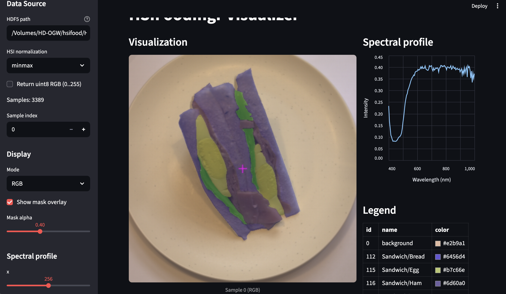
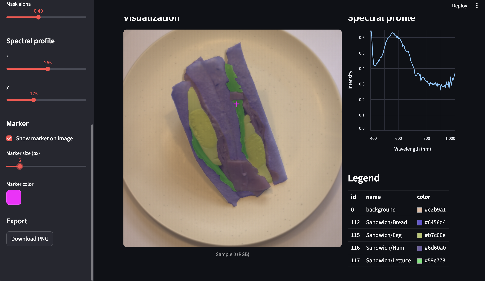

## hsifoodingr-toolkit

HSIFoodIngr-64[^1] の HDF5（例: `HSIFoodIngr-64.h5`）を安全・効率的に扱うためのツールキットです。下記のリポジトリが出力する HDF5 仕様を前提とします。

- 参照: [HSIFoodIngr-Compression](https://github.com/keitao7gawa/HSIFoodIngr-Compression)

### 構成
- PyTorch 用 Dataset: `hsifoodingr/datasets/hsi_food_ingr.py`
- HDF5 検証 CLI: `hsifoodingr/tools/check_h5.py`
- 可視化 GUI（Streamlit）: `hsifoodingr/tools/view_hsi.py`
- 設定: `environment.yml`（Anaconda 環境）/ `pyproject.toml`（パッケージ）

---

## 環境構築
Anaconda/Miniconda を想定しています。GPU を使わない CPU 環境の最小手順です。

```bash
conda env create -f environment.yml
conda activate hsifoodingr-toolkit
# プロジェクトを editable install（environment.yml に同梱済み）
# pip install -e .  # 既存環境に適用する場合
```

- 失敗時は `conda clean -a` でキャッシュを掃除し再実行してください。
- GPU/CUDA を使う場合は PyTorch の公式手順に従って適宜入れ替えてください。

---

## データセット（PyTorch）
`HSIFoodIngr-Compression` の出力 HDF5 を DataLoader で読み出す Dataset 実装です。

### 仕様
- 返却: `{"hsi": FloatTensor(B,H,W), "rgb": Float/UInt8 Tensor(3,H,W), "mask": LongTensor(H,W), "meta": dict}`
- 変換: HSI `(H,W,B)`→`(B,H,W)`、RGB `(H,W,3)`→`(3,H,W)`（回転や反転は一切なし）
- 正規化（HSI）: `none|minmax|standard|wavelength(将来拡張)`
- メタ: `ingredient_map`（JSON）、`wavelengths`、`image_basenames`、`dish_labels`
- 並列: DataLoader `num_workers>0` でワーカー毎に h5 を遅延オープン

### 使用例
```python
from hsifoodingr.datasets import HSIFoodIngrDataset
from torch.utils.data import DataLoader

ds = HSIFoodIngrDataset(
    "HSIFoodIngr-64.h5",
    normalize="minmax",
    return_uint8_rgb=False,
)
loader = DataLoader(ds, batch_size=2, num_workers=2)
sample = next(iter(loader))
print(sample["hsi"].shape, sample["rgb"].shape, sample["mask"].shape)
```

---

## 検証 CLI
HDF5 の構造・型・shape・値域・整合性を機械的に点検します。

### 実行
```bash
python -m hsifoodingr.tools.check_h5 path/to/HSIFoodIngr-64.h5 --strict --json report.json --samples 8
```
- 終了コード: OK=0, 警告=1, エラー=2
- 出力: 行ごとの警告/エラーと、最後に要約 JSON。`--json` で詳細 JSON を保存

検証観点（抜粋）
- 必須キー: `/hsi`, `/rgb`, `/masks`, `/metadata/*`
- 形状/型: `hsi (N,H,W,B) float32`, `rgb (N,H,W,3) uint8`, `masks (N,H,W) int`
- 整合性: `wavelengths` 長さと B の一致、`mask` ラベル範囲と `ingredient_map` の整合

---

## 可視化 GUI（Streamlit）
RGB/HSI/Mask を位置合わせで表示し、分光プロファイルを確認できます。Legend は各画像に含まれる `id` のみ表示し、色の 16 進コードの横に色見本を表示します。

### 起動
```bash
streamlit run hsifoodingr/tools/view_hsi.py -- --h5 path/to/HSIFoodIngr-64.h5
```

### 主な機能
- 表示モード: RGB / HSI 単バンド / 擬似カラー（波長近傍 3 バンド合成）
- マスク重ね合わせ（アルファ調整）
- 分光プロファイル（Altair グラフ）
- Legend（この画像に含まれる id のみ、色コード＋色見本）
- 画像 PNG ダウンロード

### Legend の元データ（ingredient_map）
- 本ツールは HDF5 内 `metadata/ingredient_map` を使用します。
- 以下のような「名前→ID の辞書」に対応します（例）:

```json
{
  "background": 0,
  "Eel-rice/Rice": 8,
  "Hamburger/Tomato": 28
}
```

- 色情報が無い場合は、ID をシードに決定的な擬似色を割り当てます。

---

### 操作ガイド（GUI）
1. サイドバーの「Data Source」で `--h5` に HDF5 のパスを入力
2. 「Display」で表示モード・マスク重畳・アルファ値を調整
   - Mode: RGB / HSI band / Pseudocolor（擬似カラー）
   - HSI band の場合：Band index スライダーで表示バンドを選択
3. 「Spectral profile」で座標 `(x, y)` を指定（画像上のマーカー位置と一致）
4. 「Marker」で画像上のマーカー（クロスヘア）の ON/OFF、サイズ、色を設定
5. 右ペインに分光プロファイルが表示されます（波長があれば nm 軸、なければバンド番号）
6. Legend は画像内に存在する `id` のみを表示（色見本＋16進カラー）
7. Export の Download PNG で現在の表示を保存

---

### スクリーンショット

1) GUI 全体レイアウト


2) マーカー＋スペクトルの例


---

## HDF5 の想定仕様（抜粋）
- `/hsi`: `float32 (N,H,W,B)` 例 `(N,512,512,204)`
- `/rgb`: `uint8 (N,512,512,3)`
- `/masks`: 整数 `(N,512,512)`
- `/metadata/image_basenames`: 可変長文字列 `(N,)`
- `/metadata/dish_labels`: 可変長文字列 `(N,)`
- `/metadata/ingredient_map`: 可変長文字列 `(1,)`（JSON）
- `/metadata/wavelengths`: `float32 (B,)`

---

## トラブルシュート
- `No module named 'hsifoodingr'`:
  - 環境を作り直すか、`pip install -e .` を実行してください。
- `torch` のインポート失敗:
  - `conda install pytorch -c pytorch` もしくは PyTorch 公式の案内に従ってください。
- Streamlit 実行時の引数エラー:
  - `--` の後ろにアプリ固有引数（`--h5` など）を置いてください。

---

## 開発とテスト
- テスト: `pytest`
- Lint/型: `ruff`, `mypy`

PR/課題管理は通常の GitHub フローを想定しています。


[^1]: X. Xia, W. Liu, L. Wang and J. Sun, "HSIFoodIngr-64: A Dataset for Hyperspectral Food-Related Studies and a Benchmark Method on Food Ingredient Retrieval," in IEEE Access, vol. 11, pp. 13152-13162, 2023, doi: 10.1109/ACCESS.2023.3243243. 